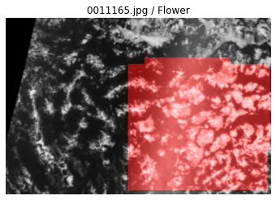

# Nebula project

The present project aims at performing a cloud segmentation of satelite images.
It is based on the following Kaggle competition:
<https://www.kaggle.com/c/understanding_cloud_organization/>

  

# Explore the project

To explore our work, just click the badges "Open In Colab" below.

<ul type="circle">
<li>Explore phase 1 notebook in Google Colab (<i>nebula_phase1_dataAnalyse.ipynb</i>)</li>

<li>Explore phase 2 notebook in Google Colab (<i>nebula_phase2_multiClassification.ipynb</i>)</li>

</ul>

More to come...

Data in support to this work can be found below:

<ul type="circle">
<li><a href="https://github.com/DataScientest/nebula/tree/master/packages"> Library of functions and classes </a></li>
<li><a href="https://htmlpreview.github.io/?https://github.com/DataScientest/nebula/blob/master/docPackages/index.html"> Library help </a></li>
</ul>

Notes:

<ul type="circle">
<li>Should nothing happen after a click, right-click the badge, then "open in new tab".</li>
<li>Google Colab will request access to your Github account on your first access.</li>
</ul>

# Us

We are a group of students from DataScientest (<https://datascientest.com/>)
